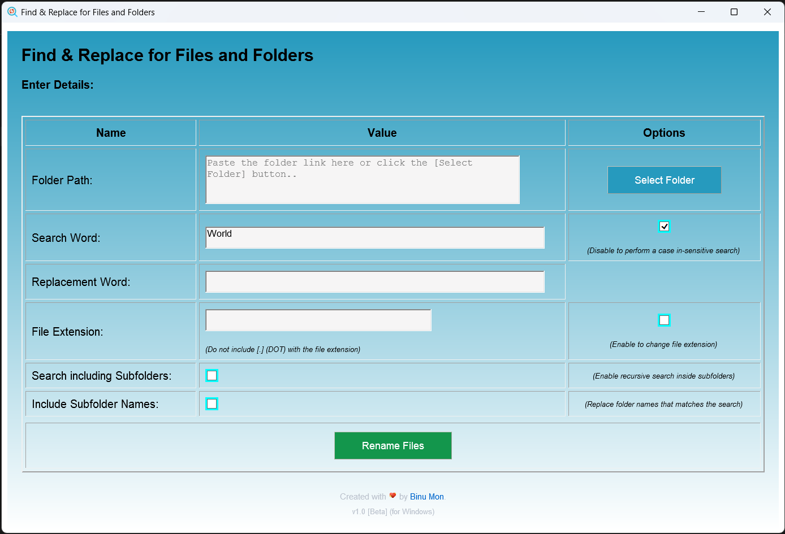

# Find and Replace for Files and Folders

`Find and Replace for Files and Folders` project is a VBScript tool (HTA) crated for bulk renaming of files or folders within a specified directory and its subdirectories in Windows Systems. This script enables users to replace occurrences of a specific word or phrase in file names and folder names with another word or phrase. It supports bulk changing of file extensions.

**Note:** 
_This is my vbScript learning project._

## Features

- **Bulk File Renaming:** Rename multiple files within a directory and its subdirectories simultaneously.
- **Search and Replace:** Replace occurrences of a specific word or phrase in file names with another word or phrase.
- **Case Sensitivity:** Option to match the search word case sensitively or insensitively.
- **Regex Search:** Search words with regex capabilities (_needs testing_)
- **Change File Extensions:** Modify file extensions during the renaming process.
- **Folder Renaming:** Rename folders based on specified criteria.
- **Logging:** Log all file renaming operations to an output text file.

## Screenshots

## Dependencies

- VBScript environment (HTA Application)

## Authors

- [@binuavin](https://www.github.com/binuavin)

## License

[GNU GPLv3](https://choosealicense.com/licenses/gpl-3.0/)

## Feedback

Feel free to contribute and enhance the functionality of the tool as needed. If you encounter any issues or have suggestions for improvements, please open an issue or submit a pull request. 

_Happy Coding!!_

